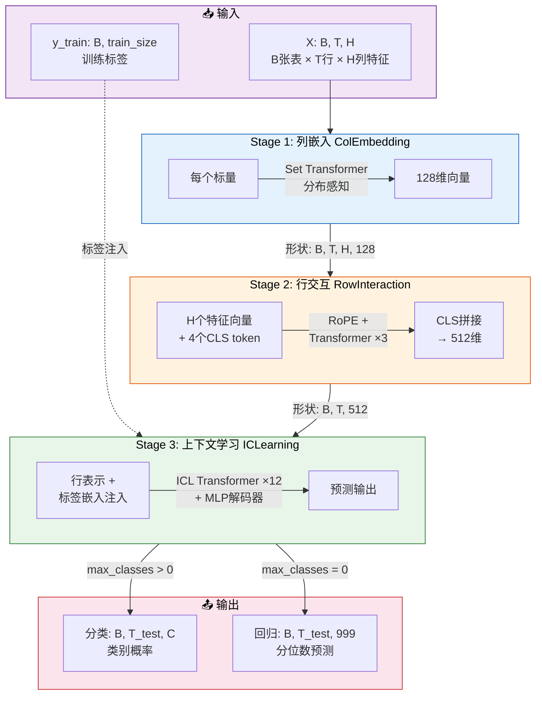

# TabICL 简化架构图



## 数据维度变化

| 阶段 | 操作 | 输入 | 输出 |
|------|------|------|------|
| **输入** | 原始表格 + 标签 | `X: (B, T, H)` `y: (B, train_size)` | — |
| **Stage 1** | 列级分布感知嵌入 | `(B, T, H)` → 每个标量 | `(B, T, H, 128)` |
| **Stage 2** | 行级特征交互 + CLS聚合 | `(B, T, H, 128)` + 4个CLS | `(B, T, 512)` |
| **Stage 3** | 标签注入 → Transformer → 解码 | `(B, T, 512)` + y_train | `(B, T_test, out_dim)` |

> **B**=batch(表数) **T**=总行数 **H**=特征数 **T_test**=T-train_size  
> **out_dim**: 分类=C(类别数) / 回归=999(分位数)

# regressor
## fit
### 集成预测
#### Shuffler类递归生成 Latin Square
下面是_latin_squares函数的递归过程原理示例：
```python
第 1 层递归: _rls([0, 1, 2, 3])
├── 随机选择: sym = 2
├── 剩余符号: [0, 1, 3]
├── 递归调用: _rls([0, 1, 3])
│
│   第 2 层递归: _rls([0, 1, 3])
│   ├── 随机选择: sym = 1
│   ├── 剩余符号: [0, 3]
│   ├── 递归调用: _rls([0, 3])
│   │
│   │   第 3 层递归: _rls([0, 3])
│   │   ├── 随机选择: sym = 3
│   │   ├── 剩余符号: [0]
│   │   ├── 递归调用: _rls([0])
│   │   │
│   │   │   第 4 层递归: _rls([0])
│   │   │   └── 基础情况: return [[0]]
│   │   │
│   │   ├── square = [[0]]
│   │   ├── square.append([0]) → [[0], [0]]
│   │   ├── 插入 sym=3:
│   │   │   square[0].insert(0, 3) → [3, 0]
│   │   │   square[1].insert(1, 3) → [0, 3]
│   │   └── return [[3, 0], [0, 3]]
│   │
│   ├── square = [[3, 0], [0, 3]]
│   ├── square.append([3, 0]) → [[3, 0], [0, 3], [3, 0]]
│   ├── 插入 sym=1:
│   │   square[0].insert(0, 1) → [1, 3, 0]
│   │   square[1].insert(1, 1) → [0, 1, 3]
│   │   square[2].insert(2, 1) → [3, 0, 1]
│   └── return [[1, 3, 0], [0, 1, 3], [3, 0, 1]]
│
├── square = [[1, 3, 0], [0, 1, 3], [3, 0, 1]]
├── square.append([1, 3, 0]) → [[1, 3, 0], [0, 1, 3], [3, 0, 1], [1, 3, 0]]
├── 插入 sym=2:
│   square[0].insert(0, 2) → [2, 1, 3, 0]
│   square[1].insert(1, 2) → [0, 2, 1, 3]
│   square[2].insert(2, 2) → [3, 0, 2, 1]
│   square[3].insert(3, 2) → [1, 3, 0, 2]
└── return [[2, 1, 3, 0], [0, 2, 1, 3], [3, 0, 2, 1], [1, 3, 0, 2]]
```

#### EnsembleGenerator类创建集成数据视图
`_generate_ensemble`方法的处理示例：

**假设条件**
```python
n_features_in_ = 3        # 3 个特征
n_estimators = 4          # 4 个基学习器
feat_shuffle_method = "latin"
norm_methods_ = ["none", "power"]
classification = False     # 回归任务
```

- 第 1 步：生成拉丁方阵特征打乱

_rls([0, 1, 2]) 递归构造 3×3 拉丁方阵，假设结果为：
```python
square = [
    [1, 0, 2],
    [2, 1, 0],
    [0, 2, 1]
]
```
再经过 `_shuffle_transpose_shuffle`（打乱行 → 转置 → 再打乱行），假设得到：

```python
X_shuffles = [
    [2, 1, 0],   # 第1行
    [0, 2, 1],   # 第2行
    [1, 0, 2],   # 第3行
]
```
注意：3 个特征只能产生 3 个拉丁方阵行（n×n 拉丁方阵恰好 n 行）。

- 第 2 步：回归任务，标签不打乱

`y_patterns = [None]`

- 第 3 步：笛卡尔积 `X_shuffles × y_patterns`

```python
shuffle_configs = [
    ([2,1,0], None),
    ([0,2,1], None),
    ([1,0,2], None),
]
```
打乱后（随机顺序，假设不变）：

```python
shuffle_configs = [
    ([2,1,0], None),
    ([0,2,1], None),
    ([1,0,2], None),
]
```

- 第 4 步：与 `norm_methods_` 做笛卡尔积，截取前 4 个
```python
shuffle_norm_configs = [
    (([2,1,0], None), "none"),    # ①
    (([2,1,0], None), "power"),   # ②
    (([0,2,1], None), "none"),    # ③
    (([0,2,1], None), "power"),   # ④
    (([1,0,2], None), "none"),    # ⑤ 截掉
    (([1,0,2], None), "power"),   # ⑥ 截掉
]
# 截取前 4 个 → [①, ②, ③, ④]
```

- 第 5 步：按归一化方法分组

最终返回值
```python
ensemble_configs = OrderedDict({
    "none": [
        ([2,1,0], None),    # 学习器1
        ([0,2,1], None),    # 学习器3
    ],
    "power": [
        ([2,1,0], None),    # 学习器2
        ([0,2,1], None),    # 学习器4
    ]
})

X_shuffle_dict = OrderedDict({
    "none":  [[2,1,0], [0,2,1]],
    "power": [[2,1,0], [0,2,1]]
})

y_pattern_dict = OrderedDict({
    "none":  [None, None],
    "power": [None, None]
})
```
- 4 个基学习器的配置总览

|学习器|归一化方法|特征顺序|含义|
|---|---|---|---|
|1|none|`[2,1,0]`|不归一化，特征按 第3→第2→第1 列排列|
|2|power|`[2,1,0]`|PowerTransformer 归一化，特征按 第3→第2→第1 列排列|
|3|none|`[0,2,1]`|不归一化，特征按 第1→第3→第2 列排列|
|4|power|`[0,2,1]`|PowerTransformer 归一化，特征按 第1→第3→第2 列排列|

---

- 注意点

拉丁方阵方法下，`n_elements=3` 只能产生 **3 种**不同的特征排列（拉丁方阵恰好 n 行），但 `n_estimators=4`。所以第 3 个排列 `[1,0,2]` 被截掉了（在与归一化方法的笛卡尔积中排第 5、6 位，超出了 `n_estimators=4` 的限制）。实际参与集成的只有 2 种特征排列 × 2 种归一化 = 4 个学习器。