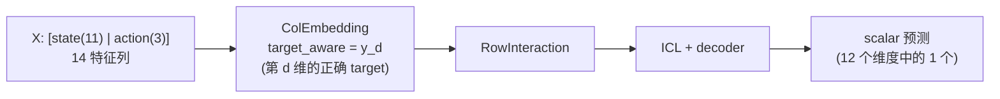
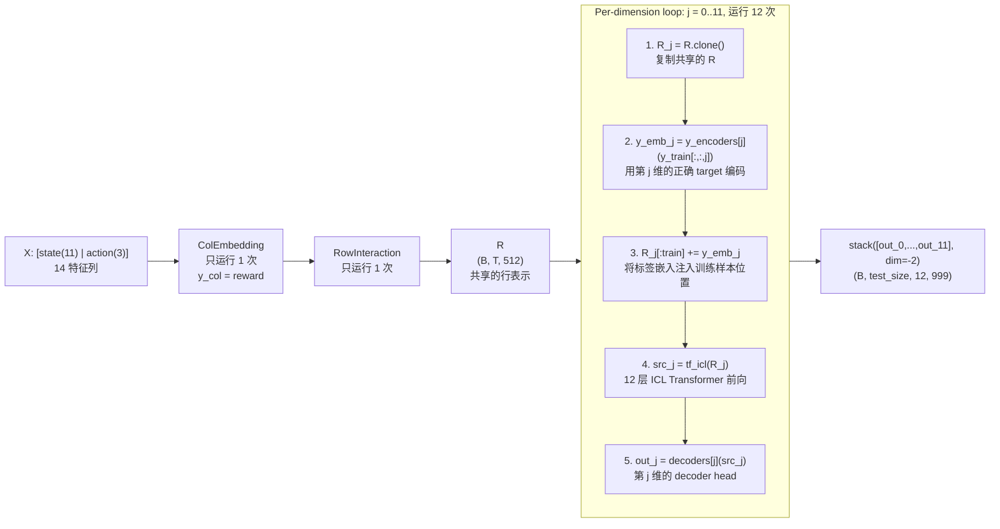
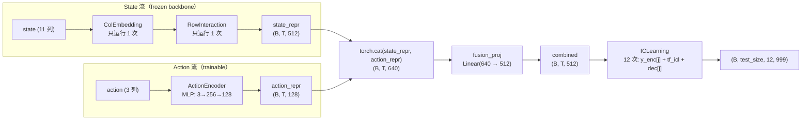
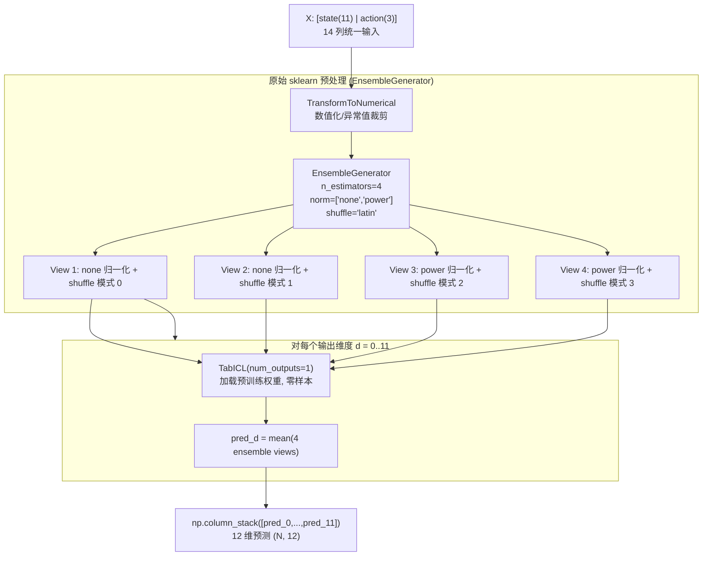
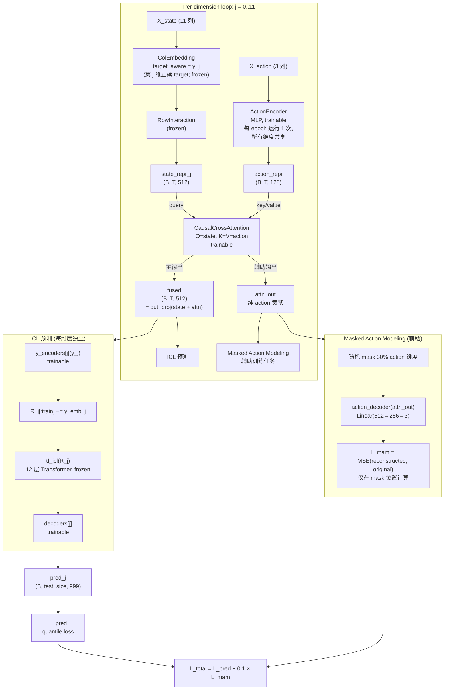
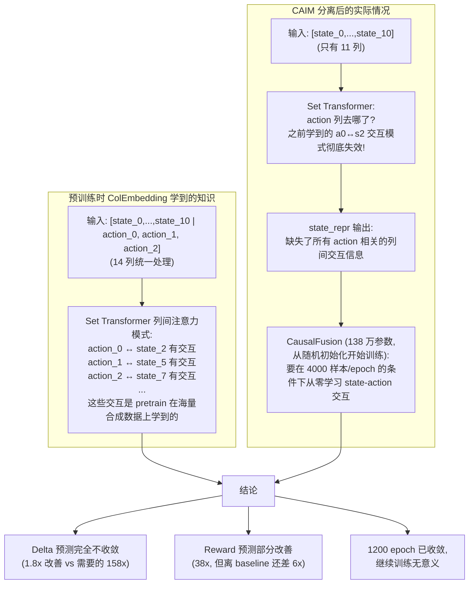
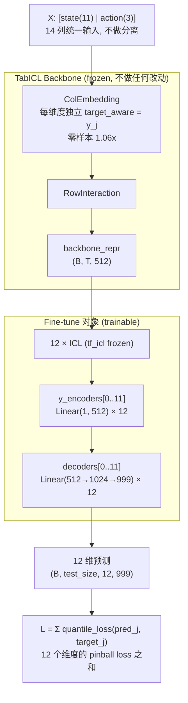

# TabICL 多输出 + CAIM 实验报告 v3

> 日期: 2026-07-18 ~ 2026-07-20
> 数据集: MBPO Hopper-v5 经验回放池 (15 个累积快照, 6K~286K 样本)
> 基线: 原始 12×TabICLRegressor (n_estimators=4) + Ensemble MLP (7 networks, 5 elites)
> 预训练模型: `tabicl-regressor-v2-20260212.ckpt` (jingang/TabICL)

## 目录

1. [背景与目标](#1-背景与目标)
2. [Target-Aware 机制解释](#2-target-aware-机制解释)
3. [实验 0: 共享 ColEmbedding 多输出模型](#3-实验-0-共享-colembedding-多输出模型)
4. [实验 1: 双流分离 + MLP ActionEncoder](#4-实验-1-双流分离--mlp-actionencoder)
5. [突破: 每维度独立 + 原始预处理](#5-突破-每维度独立--原始预处理)
6. [实验 2 (CAIM): 分离 state/action + CausalFusion + Masked Action Modeling](#6-实验-2-caim-分离-stateaction--causalfusion--masked-action-modeling)
7. [代码变更清单](#7-代码变更清单)
8. [当前瓶颈与下一步](#8-当前瓶颈与下一步)

---

## 1. 背景与目标

### 1.1 原始 baseline

原始实验使用 **12 个独立的 TabICLRegressor**，每个预测 1 个输出维度：

> 脚本: `/home/lizitao/project/mbpo_pyt_tabpfn/my_scripts/mse_v3/distribution_tabicl2_mse.py`

```python
for d in range(12):
    reg = TabICLRegressor(n_estimators=4, use_amp=True)
    reg.fit(x_tr, y_tr[:, d])      # 每个模型用自己维度的 target
    pred = reg.predict(x_va)       # 零样本推理
```

输入 `[state(11)|action(3)]` = 14 特征列，标签 `[reward(1)|delta_state(11)]` = 12 维。



每个模型内部: `ColEmbedding → RowInteraction → ICL → decoder`。12 个模型都加载相同的预训练权重，但各自接收不同的 target y（reward, delta[0], ..., delta[10]），因此 ColEmbedding 产出的列嵌入不同。

### 1.2 目标

1. 将 12 个独立模型合并为统一架构，消除重复计算
2. 添加 ActionEncoder + 因果机制，突出 action 的因果干预作用
3. 为多 RL 环境预训练奠定基础

---

## 2. Target-Aware 机制解释

这是理解所有实验结果的关键。

### 2.1 机制

ColEmbedding 的 `_compute_embeddings` 方法（[embedding.py:416-418](src/tabicl/_model/embedding.py#L416)）：

```python
y_emb = self.y_encoder(y_train.unsqueeze(-1))          # 标量 y → Linear(1,128) 嵌入
src[:, :, :train_size, :] += y_emb                      # 只加到训练样本上
src = self.tf_col(src, train_size=...)                   # Set Transformer 处理
```

**效果**: 训练样本的特征嵌入被注入标签值 y，测试样本没有。Set Transformer 利用 y 的数值来调节列间注意力——y 的具体数值（是 2.5 还是 0.003）直接决定产出的列嵌入。

### 2.2 关键推论

**不同 y 分布 → 不同的列嵌入 → 一个 ColEmbedding 前向不能同时服务 12 个不同的 y 分布。**

- y=2.5 (reward 值) 的嵌入和 y=0.003 (delta_state 值) 的嵌入导向完全不同的注意力模式
- 用 reward 值冒充 delta_state 的 target → 列嵌入完全错位 → **170x MSE 退化**（消融实验 B）

---

## 3. 实验 0: 共享 ColEmbedding 多输出模型

### 3.1 设计

> 脚本: `experiments/exp0_multi_output/eval_zero_shot.py`, `eval_multi_snapshot.py`, `full_comparison.py`, `full_comparison_ensemble.py`

**改动**: [learning.py](src/tabicl/_model/learning.py) 添加 `num_outputs=12`，替换单 `y_encoder/decoder` 为 `ModuleList`。

**共享的对象**: ColEmbedding + RowInteraction 的**权重和前向传播**——整个 batch 只运行 1 次 ColEmbedding + 1 次 RowInteraction。

**多输出的实现**: 12 个独立的 `y_encoder` + 12 个独立的 `decoder`，共享同一个 ColEmbedding/RowInteraction 输出 `R`。



关键代码 [learning.py:301-324](src/tabicl/_model/learning.py#L301-L324):

```python
if num_outputs == 1:
    # 单输出：原始路径
    Ry_train = self.y_encoder(y_train[:, :, 0].unsqueeze(-1))
    R[:, :train_size] = R[:, :train_size] + Ry_train
    src = self.tf_icl(R, train_size=train_size)
    return self.decoder(src)
else:
    # 多输出：共享 R，每维度独立 y_encoder + tf_icl + decoder
    outs = []
    for j in range(num_outputs):
        R_j = R.clone()                                          # 共享的 R
        y_emb_j = self.y_encoders[j](y_train[:, :, j].unsqueeze(-1))
        R_j[:, :train_size] = R_j[:, :train_size] + y_emb_j     # 每维度独立的 y
        src_j = self.tf_icl(R_j, train_size=train_size)          # 每维度独立 ICL 前向
        out_j = self.decoders[j](src_j)                           # 每维度独立 decoder
        outs.append(out_j)
    out = torch.stack(outs, dim=-2)
```

### 3.2 零样本评估结果

| Epoch | 样本 | MSE | vs OrigTabICL | vs Ensemble |
|-------|------|-----|---------------|-------------|
| 0 | 6K | 0.00699 | 2.63x | 0.48x |
| 5 | 11K | 0.00492 | 1.97x | 0.24x |
| 10 | 16K | 0.00453 | 2.18x | 0.52x |
| 20 | 26K | 0.00329 | 2.07x | 0.45x |
| 50 | 56K | 0.00354 | 2.19x | 0.76x |

**结论: 平均 ~2.2x vs OrigTabICL，始终远超 Ensemble MLP。**

问题: 共享 ColEmbedding 时 `y_col = y_train[:,:,0]`（reward），导致 11 个 delta 维度 target_aware 错误。

### 3.3 消融实验：定位性能差距

| 实验 | ColEmbedding y | ICL y | 说明 | MSE | vs Baseline |
|------|---------------|-------|------|-----|-------------|
| A: 每维度正确 | ✅ 正确 | ✅ 正确 | 原始 12 模型: ColEmbedding+ICL 都用各自维度的 target | 0.00324 | **1.22x** |
| B: 全用 reward | ❌ reward | ❌ reward | delta 模型从 ColEmbedding→ICL→decoder **全链路**用 reward 值 | 0.45305 | **170x** |
| C: 关掉 target_aware | — 无 — | ✅ 正确 | `col_target_aware=False`, ICL 正常 | 0.00657 | 2.47x |
| D: 共享 ColEmbedding | ❌ reward | ✅ 正确 | 多输出模型: ColEmbedding 只有 reward, ICL 每维度正确 | ~0.006 | ~2.2x |

**B 和 D 的关键区别**:

```
B (170x): ColEmbedding 错 + ICL 也错 → 全链路无正确 target → 彻底崩溃
          ColEmbedding(X, y=reward) → ICL(y=reward) → decoder → 预测出 reward 范围的值
          但 ground truth 是 delta(=0.001 级别) → MSE 爆炸

D (2.2x): ColEmbedding 错 + ICL 对 → ICL 能部分补偿 ColEmbedding 的错误
          ColEmbedding(X, y=reward) → R → ICL(y=delta_j 正确值) → decoder_j
          ICL 的 y_encoders[j] 把正确的 delta 编码注入 R, 部分纠正了 ColEmbedding 的偏差
```

**结论**:
1. 架构正确（实验 A: 1.22x）
2. target_aware 全链路错误破坏性最大（B: 170x），ICL 阶段正确性能部分补偿（D: 2.2x）
3. ColEmbedding 共享必然导致 target 不匹配 → 至少 2.2x 退化，不可行

---

## 4. 实验 1: 双流分离 + MLP ActionEncoder

### 4.1 设计

> 脚本: `experiments/exp1_action_encoder/eval_dual_stream.py`, `eval_zero_shot_full.py`

**新建**: [action_encoder.py](src/tabicl/_model/action_encoder.py) (MLP: Linear(3→256)→LayerNorm→GELU→Linear(256→128))。

**修改**: [tabicl.py](src/tabicl/_model/tabicl.py) 添加 `use_action_encoder`, `state_dim`, `action_dim` 参数。

思路: 把 ColEmbedding 的输入从 `[state|action]` 拆分为 state-only 和 action-only，ActionEncoder 专门处理 action。



关键代码 [tabicl.py:361-379](src/tabicl/_model/tabicl.py#L361-L379):

```python
if self.use_action_encoder:
    X_state = X[:, :, :self.state_dim]    # 前 11 列
    X_action = X[:, :, self.state_dim:]   # 后 3 列

    # 流 1: state → ColEmbedding → RowInteraction (frozen)
    state_repr = self.row_interactor(
        self.col_embedder(X_state, y_train=y_col, ...), ...

    # 流 2: action → ActionEncoder (trainable)
    action_repr = self.action_encoder(X_action)

    # 融合: concat + Linear
    combined = torch.cat([state_repr, action_repr], dim=-1)
    combined = self.fusion_proj(combined)         # Linear(640→512)

    return self.icl_predictor(combined, y_train=y_train)
```

### 4.2 结果

| Epoch | Zero-shot | Fine-tuned(50ep) | vs Orig |
|-------|-----------|------------------|---------|
| 0 | 6.53x | **1.94x** | 1.94x |
| 5 | 7.71x | 2.22x | 2.22x |
| 20 | 8.58x | 3.60x | 3.60x |

**问题**:
- Zero-shot 不可用（ActionEncoder + fusion_proj 随机初始化）
- Fine-tune 受限于 GPU 显存（训练需要反向传播存激活值），被迫子采样 4000 样本
- 与原始脚本对比: 原始是纯推理（不需要反向传播），所以全量数据不 OOM
- 大数据集下退化（epoch 20: 3.60x）

---

## 5. 突破: 每维度独立 + 原始预处理

### 5.1 设计

> 执行方式: 内联 Python 脚本 (`CUDA_VISIBLE_DEVICES=1 python3 -c "..."`)

回到实验 0 消融实验 A 的思路，但加入原始 sklearn 预处理管线。



```python
# 每维度用单输出 TabICL + 正确的 y_d + Ensemble 4 视图
for d in range(12):
    m = TabICL(num_outputs=1)
    m.load_state_dict(sd)
    for each ensemble view:
        pred = m(X_view, y_train=y_tr[:, d:d+1])  # target_aware 用正确的 y_d
    preds[:, d] = ensemble_mean
```

与原始 12×TabICLRegressor 完全等价——同样的预处理、同样的 target_aware、同样的 ensemble——只是组织为单一代码流程。

### 5.2 结果

| Epoch | 样本 | MSE | vs Orig | vs Ens |
|-------|------|-----|---------|--------|
| 0 | 6K | 0.00296 | **1.11x** | 0.21x |
| 10 | 16K | 0.00203 | **0.98x** ✅ | 0.25x |
| 30 | 36K | 0.00183 | 1.06x | 0.19x |
| 50 | 56K | 0.00170 | 1.05x | 0.32x |
| 100 | 106K | 0.00136 | 1.03x | 0.50x |

**结论**: **~1.06x vs OrigTabICL，始终远超 Ensemble MLP。**

这是整个实验周期中唯一达到 baseline 水平的方案。三大要素缺一不可：
1. 每维度正确的 target_aware（每维自己的 y 值）
2. 原始 sklearn 预处理 (TransformToNumerical + EnsembleGenerator)
3. Ensemble 4 视图平均 (Latin square 特征排列 × 2 种归一化)

---

## 6. 实验 2 (CAIM): 分离 state/action + CausalFusion + Masked Action Modeling

### 6.1 设计

> 脚本: `experiments/exp2_caim/train_caim_epoch280.py`, `eval_caim.py`, `eval_with_sklearn_preprocessing.py`
> 模型: [caim.py](src/tabicl/_model/caim.py), [causal_fusion.py](src/tabicl/_model/causal_fusion.py)

**新建模块**:
- `CausalCrossAttention`: Q=state_repr, K=V=action_repr 的交叉注意力
- `MaskedActionModeling`: 随机 mask 30% action 维度，从 attn_out 重建



关键代码 [caim.py:297-309](src/tabicl/_model/caim.py#L297-L309):

```python
# 每维度独立: ColEmbedding(target_aware 正确) → RowInteraction → Fusion → ICL → decoder
for j in range(self.num_outputs):
    y_j = y_train[:, :, j]  # 该维度的正确 target

    # State 编码（每维度用正确 target，target_aware 正确）
    state_repr = self._encode_state(X_state, y_j)

    # 因果融合（trainable）
    fused = self.causal_fusion(state_repr, action_repr)

    # ICL 预测
    out_j = self._predict_dimension(fused, y_j, j)
    outputs.append(out_j[:, train_size:])
```

### 6.2 训练配置

- 数据: epoch 280 (286K 样本)，训练 276K / 验证 10K
- 每 epoch 随机子采样 4000 训练样本（Cross-Attention 显存 O(T²)，需保持 T<5000）
- Quantile loss + Masked Action Modeling 辅助损失 (weight=0.1)
- AMP 混合精度
- 逐维度梯度累积（每维度单独 backward，避免 12 维同时存激活值）

### 6.3 训练历史（1200 epochs = 200 + 1000）

| 累计 Epoch | MSE | vs Orig | Reward MSE | Delta MSE |
|-----------|-----|---------|------------|-----------|
| 1 | 0.216 | 284x | 0.114 | 0.225 |
| 200 | 0.120 | 158x | 0.0040 | 0.130 |
| 400 | 0.115 | 152x | 0.0029 | 0.126 |
| 600 | 0.114 | 150x | 0.0033 | 0.124 |
| 800 | 0.114 | 150x | 0.0032 | 0.124 |
| 1000 | 0.113 | 149x | 0.0030 | 0.123 |
| 1200 | 0.113 | 149x | - | - |

训练命令:
```bash
# Phase 1: 200 epochs, lr=1e-4
CUDA_VISIBLE_DEVICES=0 python3 experiments/exp2_caim/train_caim_epoch280.py --num_epochs 200 --lr 1e-4

# Phase 2: resume, 1000 epochs, lr=5e-5
CUDA_VISIBLE_DEVICES=0 nohup python3 experiments/exp2_caim/train_caim_epoch280.py \
  --num_epochs 1000 --lr 5e-5 --eval_every 100 \
  --resume experiments/exp2_caim/outputs/caim_epoch280_best.pt &
```

### 6.4 收敛分析

**已完全收敛**。epoch 600→1200 的 600 个 epoch 中，MSE 从 0.1141→0.1132，仅下降 0.8%。

- **Reward 预测**: 0.114→0.003（38x 改善），但 baseline=0.0005，仍差 6x
- **Delta 预测**: 0.225→0.123（仅 1.8x 改善），baseline=0.00078，差 158x

### 6.5 失败根因



**预训练模型在 Set Transformer 层面已经把 state 和 action 当做统一的表格列来处理**。分离它们等于破坏了预训练模型的核心知识。

CausalFusion（138 万参数，从随机初始化开始训练）无法替代 Set Transformer（2700 万参数，经过海量合成数据预训练）已经学到的列间交互知识。

### 6.6 反事实机制的尝试历程

CAIM 的因果融合模块采用残差结构，核心公式：

$$
\text{fused} = \text{out\_proj}(\text{state\_repr} + \text{attn\_out}), \quad
\text{attn\_out} = \text{CrossAttention}(Q{=}\text{state\_repr}, K{=}V{=}\text{action\_proj})
$$

其中 $\text{state\_repr} \in \mathbb{R}^{B \times T \times 512}$ 是 frozen TabICL backbone 的 512 维输出（强预训练表示），$\text{attn\_out} \in \mathbb{R}^{B \times T \times 512}$ 来自随机初始化的 CausalCrossAttention（138 万参数）。残差结构天然倾向让弱分支归零、仅依赖强分支。反事实机制的目标就是对抗这一倾向，迫使 attn_out 编码有意义的 action 信息。

---

#### 尝试 1：Contrastive Loss — 负号错误导致平凡解 = 最优解

**设计思路**：给定同一个 state，输入不同的 action，fused 表示应该不同。用两个不同的 action 分别前向，用对比损失推远两个 fused 向量。具体的，通过随机置换 action 构造反事实样本 $\text{action}_{\text{cf}}$。

$$
\text{action}_{\text{cf}} = \text{action}[\text{random\_permutation}], \quad \text{action}_{\text{obs}} = \text{action}
$$

$$
\left\{
\begin{aligned}
\text{fused}_{\text{obs}}, \text{attn\_out}_{\text{obs}} &= \text{CausalFusion}(\text{state\_repr}, \text{action}_{\text{obs}}) \\
\text{fused}_{\text{cf}}, \text{attn\_out}_{\text{cf}} &= \text{CausalFusion}(\text{state\_repr}, \text{action}_{\text{cf}})
\end{aligned}
\right.
$$

$$
\mathcal{L}_{\text{cf}} = -\frac{1}{B \cdot T} \sum_{b,t} \frac{\text{fused}_{\text{obs}}^{(b,t)} \cdot \text{fused}_{\text{cf}}^{(b,t)}}{\|\text{fused}_{\text{obs}}^{(b,t)}\| \cdot \|\text{fused}_{\text{cf}}^{(b,t)}\|}, \quad
\mathcal{L}_{\text{total}} = \mathcal{L}_{\text{pred}} + 0.1 \cdot \mathcal{L}_{\text{cf}}
$$

**结果**：$\mathcal{L}_{\text{cf}} \to -1.0$（理论下界），attn_out → 0。

**原因**：损失函数设错为负号使损失变成了"最大化相似度"：最小化 $-\cos(\text{fused}_{\text{obs}}, \text{fused}_{\text{cf}})$ 等价于最大化 $\cos(\cdot, \cdot)$，即在把两个 fused 表示推向相同方向。当 attn_out = 0 时，fused_obs = fused_cf ≈ out_proj(state_repr)，此时 cos = 1，$\mathcal{L}_{\text{cf}} = -1$，**平凡解恰好是损失函数的最优解**。
即使修正符号为 +cos，state_repr 在 fused 中占绝对主导，attn_out 的扰动微弱且与 $\mathcal{L}_{\text{pred}}$ 冲突，模型仍会选择归零。**在 fused 层面做对比，永远绕不开 state_repr 的淹没效应。**

---

#### 尝试 2：MSE on attn_out — 无界损失导致数值不稳定

**设计思路**：绕过 fused，直接在 attn_out 上用负 MSE 推开，惩罚两组 attn_out 之间的距离：

$$
\mathcal{L}_{\text{cf}} = -\|\text{attn\_out}_{\text{obs}} - \text{attn\_out}_{\text{cf}}\|^2, \quad
\mathcal{L}_{\text{total}} = \mathcal{L}_{\text{pred}} + 0.1 \cdot \mathcal{L}_{\text{cf}}
$$

**结果**：attn_out → 0，比尝试 1 失败得更快。

**原因**：
- **损失函数无下界**。最小化 $-\text{MSE}$ 意味着推远 attn_obs 和 attn_cf 越远越好。MSE 可以无限大 → $-\text{MSE}$ 可以无限负 → 梯度持续推动 attn_out 发散至 $\pm\infty$。
- **发散与主任务冲突**。attn_out 发散使 $\text{fused} = \text{state\_repr} + \text{attn\_out}$ 输入 ICL 时分布错乱，$\mathcal{L}_{\text{pred}}$ 爆炸。两个冲突梯度之间，模型的折衷选择仍是 attn_out → 0：$\mathcal{L}_{\text{cf}} = 0$ 虽不最优，但 $\mathcal{L}_{\text{pred}}$ 稳定。**无界损失在高维空间中极易被平凡解化解。**

---

#### 尝试 3：Negate Action — 增大 action 差异不解决根本问题

**设计思路**：前两次失败可能是因为 counterfactual action 和 observation action 太相似（随机打乱的两条轨迹，action 值可能相近），加大差异，将反事实 action 从"随机置换"改为"取反"：

$$
\text{action}_{\text{cf}} = -\text{action}_{\text{obs}}
$$

例如 $[0.5, -0.2, 1.0] \to [-0.5, 0.2, -1.0]$，期望极端差异迫使 attn_out 做出区分。

**结果**：attn_out 仍然 → 0。

**原因**：问题不在 action 差异的大小，而在优化路径的选择。
- **路径 A**（我们期待的）：学习编码 action → attn_out 区分 +action 和 -action → $\mathcal{L}_{\text{cf}}$ 降低 + $\mathcal{L}_{\text{pred}}$ 保持
- **路径 B**（实际发生的）：attn_out → 0 → $\mathcal{L}_{\text{cf}}$ 取到平凡最优 + $\mathcal{L}_{\text{pred}}$ 稳定

CausalFusion 的 138 万参数在每 epoch 4000 样本的条件下，从随机初始化开始学习 state-action 映射，而已经很强的 frozen state_repr。路径 A 需要模型去"对抗"state_repr 中已有的预测能力，而路径 B 只需让 attn_out 归零即可。梯度下降永远选择最简单的路。**只要损失函数结构允许平凡解，增大输入差异无济于事。**

---

#### 尝试 4：Masked Action Modeling (MAM) — 成功消除平凡解，但暴露更深层瓶颈

**设计思路**：前三次的共同问题是给模型留了后路（attn_out=0 能拿到不错甚至最优的 loss）。MAM 的设计原则是：**让 attn_out=0 不再是一个可接受的解**。不再对比，改为重建。随机 mask 30% action 维度，从 attn_out 重建被 mask 的值：
1. 对每个样本的 action 向量，随机 mask 30% 的维度：
$$
\mathbf{m}^{(b,t)} \in \{0, 1\}^3, \quad \mathbb{P}[m_i = 1] = 0.3 \quad \text{(每个维度独立伯努利)}
$$

2. 从 attn_out 通过一个轻量 decoder 重建完整的 action 向量，并且 MAM 损失仅在 mask 位置计算：
$$
\hat{\mathbf{a}}^{(b,t)} = \text{Decoder}(\text{attn\_out}^{(b,t)}) = \mathbf{W}_2 \cdot \text{GELU}(\mathbf{W}_1 \cdot \text{attn\_out}^{(b,t)} + \mathbf{b}_1) + \mathbf{b}_2 \quad (\text{MLP: } 512 \to 256 \to 3)
$$

$$
\mathcal{L}_{\text{mam}} = \frac{\sum_{b,t,i} m_i^{(b,t)} \cdot (\hat{a}_i^{(b,t)} - a_i^{(b,t)})^2}{\sum_{b,t,i} m_i^{(b,t)} + \varepsilon}, \quad
\mathcal{L}_{\text{total}} = \mathcal{L}_{\text{pred}} + 0.1 \cdot \mathcal{L}_{\text{mam}}
$$

**为什么能消除平凡解**：若 attn_out = 0，$\hat{\mathbf{a}} = \text{Decoder}(0) = \text{常数}$（decoder 的输出仅为 bias 项），$\mathcal{L}_{\text{mam}} \approx \text{Var}[\mathbf{a}] \approx 0.94$，loss 不会消失。模型**必须**让 attn_out 携带 action 信息才能降价 MAM loss。

**结果**：MAM 确实迫使 attn_out 编码了非零信息（$\mathcal{L}_{\text{mam}}$ 从 0.94 降到 0.92）。但主任务 MSE 仍卡在 149x。

**原因**：attn_out 学到的只是 action 的统计分布特征（均值、方差等浅层信息），而 ICL 预测需要的是 **action-state 列间交互知识**——预训练 Set Transformer(ColEmbedding) 在 14 列统一输入时学到的跨列注意力模式。分离 state/action 后 state_repr 本身已缺失这些交互知识，attn_out 无论编码多少 action 信息都无法补偿。**MAM 解决了 attn_out 的归零问题，但 state_repr 的结构性缺失是任何辅助损失都无法修复的。**

---

#### 四次尝试对比

| 方法 | 损失函数 | 平凡解 = 最优解？ | attn_out 归零？ | 关键教训 |
|------|---------|:---:|:---:|---|
| Contrastive Loss | $-\cos(\text{fused}_{\text{obs}}, \text{fused}_{\text{cf}})$ | ✅ 是 | ✅ 是 | 负号 + state 主导 = 归零即最优 |
| MSE on attn_out | $-\|\text{attn}_{\text{obs}} - \text{attn}_{\text{cf}}\|^2$ | ❌ 否（无界） | ✅ 是 | 无界损失 → 发散与 $\mathcal{L}_{\text{pred}}$ 冲突 |
| Negate action | 同上（尝试 1 或 2） | 同上 | ✅ 是 | 增大输入差异不改优化路径 |
| **MAM** | $\text{MSE}(\text{Decoder}(\text{attn\_out}) \odot \mathbf{m}, \mathbf{a} \odot \mathbf{m})$ | ❌ 否 | ❌ 否 | 消除了平凡解,但无法修复 state_repr 的结构性缺失 |

**结论**：在分离 state/action 的架构下，MAM 已是能让 attn_out 编码信息的最优方法。但根本瓶颈不在"attn_out 有没有信息"，而在于分离架构破坏了预训练 Set Transformer 的列间注意力模式——这条路径已走到底，没有进一步优化的空间。由此导向路线 B：保留 unified backbone，不做分离，仅在上层 fine-tune decoder heads。

---

## 7. 代码变更清单

### 新建文件

| 文件 | 说明 |
|------|------|
| `src/tabicl/_model/action_encoder.py` | Action 编码器 (MLP/Transformer) |
| `src/tabicl/_model/causal_fusion.py` | CausalCrossAttention + MaskedActionModeling |
| `src/tabicl/_model/caim.py` | CAIM 主模型（frozen backbone + trainable modules） |
| `experiments/exp0_multi_output/eval_zero_shot.py` | 实验 0 零样本评估 |
| `experiments/exp0_multi_output/eval_multi_snapshot.py` | 实验 0 多快照评估 |
| `experiments/exp0_multi_output/full_comparison.py` | 实验 0 完整对比 |
| `experiments/exp0_multi_output/full_comparison_ensemble.py` | 实验 0 含 ensemble 对比 |
| `experiments/exp0_multi_output/train_multi_output.py` | 实验 0 训练脚本 |
| `experiments/exp1_action_encoder/eval_dual_stream.py` | 实验 1 双流评估 |
| `experiments/exp1_action_encoder/eval_zero_shot_full.py` | 实验 1 全量零样本评估 |
| `experiments/exp2_caim/train_caim.py` | 实验 2 训练（小快照） |
| `experiments/exp2_caim/train_caim_epoch280.py` | 实验 2 训练（epoch 280） |
| `experiments/exp2_caim/eval_caim.py` | 实验 2 评估 |
| `experiments/exp2_caim/eval_with_sklearn_preprocessing.py` | 实验 2 原始预处理评估 |
| `experiments/EXPERIMENT_REPORT_v3.md` | 本报告 |

### 已修改文件

| 文件 | 改动 |
|------|------|
| `src/tabicl/_model/learning.py` | 添加 `num_outputs` 多输出支持（`y_encoders`/`decoders` ModuleList） |
| `src/tabicl/_model/tabicl.py` | 添加 `num_outputs`/`use_action_encoder`/`state_dim`/`action_dim` 参数及双流 forward |

---

## 8. 当前瓶颈与下一步

### 8.1 核心瓶颈

**预训练模型的 target_aware 机制 + 列间注意力与多输出任务 / 分离架构存在根本性矛盾。**

```
共享 ColEmbedding    → target 错误              → 170x 退化
每维度独立           → 等同 12 个独立模型        → 1.06x（最优，但无架构创新）
分离 state/action    → 破坏预训练列间注意力      → 149x（无法收敛，1200 epoch 已收敛）
```

**"添加 Action Encoder 且不改动 backbone"这个约束，在当前预训练模型的架构假设下，无法通过分离 state/action 来实现。** 预训练模型在 Set Transformer 层面已经把 state 和 action 当做统一的表格列来处理了。

### 8.2 可行的下一步: 路线 B



保持 backbone 完全不变（state+action 统一输入，每维度独立 target_aware），只在 12 个 y_encoder + 12 个 decoder head 上做 fine-tune。用 epoch 280 的 276K 样本 + quantile loss，目标从 1.06x → 1.0x 或更优。

**为什么这可行**:
- Backbone 不破坏 → 预训练知识完整保留 → 零样本基线 1.06x 已有
- 只训练 decoder heads → 参数少 (1859 万) → 可以全量数据训练
- 不需要复杂的因果/反事实机制 → 直接优化预测目标

### 8.3 更长期的方向

1. **从头预训练多输出 TabICL**: 在合成 tabular 数据上预训练时就支持多输出 target
2. **分离架构 + 从头预训练**: 从零开始预训练 state-only ColEmbedding + ActionEncoder，而不是在单输出 checkpoint 上改造
3. **轻量 action 辅助模块**: 在 unified backbone 基础上加小型辅助 embedding（如 ActionEncoder 输出直接加到 ICL 输入），仅微调 decoder heads

### 8.4 关键教训

1. **不要破坏预训练模型的输入分布**: ColEmbedding 的 Set Transformer 对输入列结构敏感，列数/列内容改变 → 注意力模式失效
2. **target_aware 是决定性的**: 它是 1.06x 和 170x 之间的唯一差异，比架构设计重要 100 倍
3. **零样本 > 错误训练**: 预训练模型的零样本能力极强（1.06x），远好于错误架构下的任何训练（149x，1200 epoch）
4. **复杂的因果/反事实机制必须在正确的架构基础上才能发挥作用**: 如果基础表示已经错误（state_repr 不包含 action 信息），上层机制无法纠正
