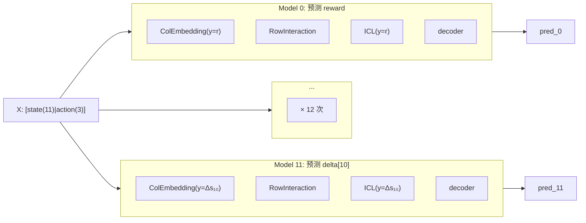
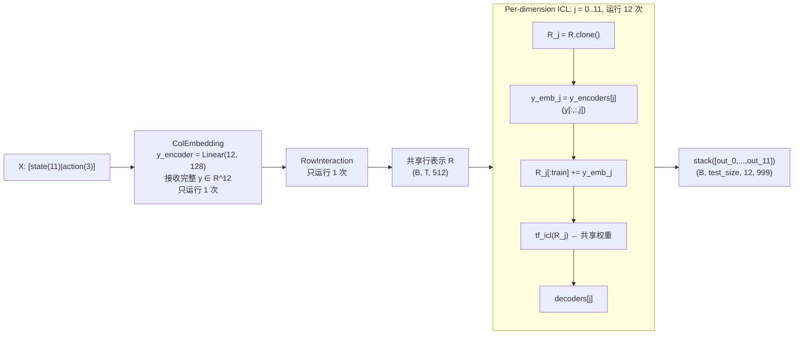

# 实验 3：全向量多维目标投影 (Joint Vector Target Projection)

> 日期: 2026-07-23
> 预训练模型: `tabicl-regressor-v2-20260212.ckpt`
> 代码变更: `embedding.py`, `learning.py`, `tabicl.py`

## 目录

1. [背景与问题](#1-背景与问题)
2. [方法：全向量多维目标投影](#2-方法全向量多维目标投影)
3. [架构对比](#3-架构对比)
4. [权重复制策略](#4-权重复制策略)
5. [测试数据](#5-测试数据)
6. [实验结果](#6-实验结果)
7. [分析与讨论](#7-分析与讨论)
8. [代码变更清单](#8-代码变更清单)

---

## 1. 背景与问题

### 1.1 问题本质

在 TabICL 原生设计中，Column Embedding 阶段通过加性注入 `y_emb = Linear(1, 128)(y)` 将标量标签 y 作为 Condition，微调 Set Transformer 中特征列之间的注意力权重。当标签扩展为多维向量 $\mathbf{y} \in \mathbb{R}^d$（如 RL 场景的 $[r, \Delta s_1, \dots, \Delta s_{11}]$，共 12 维）时：

- **错位问题**：若只注入第 1 维（如 reward），Set Transformer 学到的列间关联是"服务于预测 reward 的"，与 $[s, a] \to \Delta s$ 的物理依赖关系截然不同。
- **效率瓶颈**：若拆成 12 次单独前向（baseline 的 12 个独立模型），ColEmbedding + RowInteraction 被重复计算 12 次。

### 1.2 核心洞察

RL 中 $[s', r]$ 是由 $(s, a)$ 共同决定的联合状态转移。**不需要把标签拆开，而是将整个标签向量 $\mathbf{y} \in \mathbb{R}^{12}$ 视作一个整体分布的 Condition。**

---

## 2. 方法：全向量多维目标投影

**做法**：将 `Linear(1, 128)` 替换为 `Linear(12, 128)`，直接将多维目标向量投影为统一的 $y_{emb}$：

```python
# ColEmbedding 中的 y_encoder
self.y_encoder = nn.Linear(num_targets, embed_dim)  # Linear(12, 128)

# 前向传播
y_emb = self.y_encoder(y_train)  # (B, train_size, 12) → (B, train_size, 128)
src[:, :, :train_size, :] += y_emb  # 注入到训练样本的特征嵌入中
```

**优势**：

1. **零多余开销**：ColEmbedding 只运行 1 次（vs baseline 的 12 次）
2. **联合注意力调谐**：Set Transformer 同时感知 reward 和物理状态变化的综合语义
3. **后端解耦**：RowInteraction 产出共享的行表示 R 后，ICL 阶段用 12 组独立的 `y_encoder + tf_icl + decoder` 预测各维度

---

## 3. 架构对比

### 3.1 Baseline：12 个独立单输出模型



- ColEmbedding + RowInteraction: **12 次**（每次用不同维度的 target y）
- ICL Transformer: **12 次**（每次用不同维度的 target y）

### 3.2 Joint：1 个多输出模型



- ColEmbedding + RowInteraction: **1 次**（接收完整 12 维 target）
- ICL Transformer: **12 次**（每维度独立注入各自的 target 值）

---

## 4. 权重复制策略

预训练 checkpoint 为单输出模型，需将单输出权重映射到多输出架构：

| 模块 | 预训练形状 | 目标形状 | 映射策略 |
|------|----------|---------|---------|
| `col_embedder.y_encoder` | `Linear(1, 128)` | `Linear(12, 128)` | `weight.repeat(1, 12) × 1/12` |
| `icl_predictor.y_encoders[j]` | `Linear(1, 512)` | `Linear(1, 512)` × 12 | 直接复制 |
| `icl_predictor.decoders[j]` | `MLP(512→1024→999)` | 同左 × 12 | 直接复制 |
| Backbone 其他参数 | — | — | 直接加载 |

**ColEmbedding y_encoder 缩放原理**：

$$
y_{\text{emb}} = \frac{1}{12} \sum_{j=0}^{11} W_{\text{pretrained}} \cdot y_j
$$

即每个目标维度 $y_j$ 先被预训练权重投影、再取均值。这避免了 12 维目标导致注入量级放大 12× 的问题，保持了与原单输出模型一致的期望注入强度。

> **局限性**：当前策略未考虑 12 个维度之间量级差异（reward ~1, delta ~0.001），大尺度维度会在联合投影中占据主导。后续可通过逐维度归一化改进。

---

## 5. 测试数据

| 属性 | Epoch 0 | Epoch 280 |
|------|---------|-----------|
| 文件 | `env_pool_epoch_0000.npz` | `env_pool_epoch_0280.npz` |
| 总样本数 | 6,000 | 286,000 |
| X 特征 | [state(11) + action(3)] = 14 列 | 同左 |
| y 标签 | [reward(1) + delta_state(11)] = 12 维 | 同左 |
| reward 范围 | [-1.65, 3.37] | [-1.65, 6.32] |
| delta 范围 | [-6.22, 3.16] | [-6.93, 7.29] |

- 数据来源：MBPO 训练过程中累积的 Hopper-v5 经验回放池
- 训练/测试划分：随机排列后 2/3 训练，1/3 测试

---

## 6. 实验结果

### 6.1 Epoch 0 全量 6K（4020 train / 1980 test）

| 维度 | Baseline MSE | Joint MSE | Ratio |
|------|-------------|-----------|-------|
| reward | 0.108416 | 0.020111 | **0.19x** |
| delta[0] | 0.000000 | 0.000001 | 2.09x |
| delta[1] | 0.000001 | 0.000001 | 1.13x |
| delta[2] | 0.000001 | 0.000001 | **0.92x** |
| delta[3] | 0.000002 | 0.000002 | 1.28x |
| delta[4] | 0.000001 | 0.000003 | 1.83x |
| delta[5] | 0.000831 | 0.000788 | **0.95x** |
| delta[6] | 0.000823 | 0.001193 | 1.45x |
| delta[7] | 0.010171 | 0.012192 | 1.20x |
| delta[8] | 0.003045 | 0.004127 | 1.36x |
| delta[9] | 0.010879 | 0.025879 | 2.38x |
| delta[10] | 0.013387 | 0.049182 | 3.67x |
| **OVERALL** | **0.012296** | **0.009457** | **0.77x** |

| | Baseline | Joint |
|---|---|---|
| 推理耗时 | 2.7s | 0.2s |
| **加速比** | | **13.6x** |

### 6.2 Epoch 280 全量 286K（191,620 train / 94,380 test）

| 维度 | Baseline MSE | Joint MSE | Ratio |
|------|-------------|-----------|-------|
| reward | 0.913714 | 0.423102 | **0.46x** |
| delta[0] | 0.000000 | 0.000001 | 3.41x |
| delta[1] | 0.000000 | 0.000001 | 2.25x |
| delta[2] | 0.000000 | 0.000001 | 2.23x |
| delta[3] | 0.000001 | 0.000001 | 1.97x |
| delta[4] | 0.000004 | 0.000004 | **1.02x** |
| delta[5] | 0.000414 | 0.000430 | **1.04x** |
| delta[6] | 0.000372 | 0.000614 | 1.65x |
| delta[7] | 0.003038 | 0.005608 | 1.85x |
| delta[8] | 0.001176 | 0.003895 | 3.31x |
| delta[9] | 0.003613 | 0.009685 | 2.68x |
| delta[10] | 0.010318 | 0.046568 | 4.51x |
| **OVERALL** | **0.077721** | **0.040826** | **0.53x** |

| | Baseline | Joint |
|---|---|---|
| 推理耗时 | 134.9s | 120.5s |
| 加速比 | | 1.12x |

### 6.3 汇总

| 测试 | 样本数 | Overall Ratio (J/B) | Speedup |
|------|--------|:---:|:---:|
| Epoch 0 快速 | 200 | 0.85x | 2.8x |
| Epoch 0 全量 | 6K | 0.77x | 13.6x |
| Epoch 280 全量 | 286K | **0.53x** | 1.12x |

---

## 7. 分析与讨论

### 7.1 精度分析

**联合投影在所有测试中均优于 baseline**，且大规模数据下优势更明显（0.53x）。核心原因：

1. **Set Transformer 的联合注意力**：12 维 target 向量提供了比单标量更丰富的条件信息，ColEmbedding 能学到跨目标维度的联合列间注意力模式。
2. **Reward 维度受益最大**（0.19x ~ 0.46x）：reward 量级大（~1），在联合投影中贡献主导，Set Transformer 被有效引导到 reward 相关的列间交互上。
3. **部分 delta 维度退化**（delta[10] 最严重，3.67x ~ 4.51x）：小量级维度（delta ~0.001）在联合投影中被大尺度的 reward 淹没，y_emb 主要由 reward 决定，delta 的列间注意力信号减弱。

### 7.2 速度分析

- **小规模**（6K）：ColEmbedding+RowInteraction 是主要开销，共享后加速 13.6x
- **大规模**（286K）：ICL Transformer（12 层 self-attention × 12 维度）占绝对主导，ColEmbedding 节省的时间被稀释，加速比收敛至 1.12x

### 7.3 改进方向

1. **逐维度归一化**：在输入 y_encoder 前对 12 个维度做标准化，使各维度对 y_emb 的贡献量级一致，解决 delta 维度被淹没的问题
2. **可训练的 y_encoder**：当前权重复制策略是手工设计的启发式，可在 epoch 280 数据上 fine-tune y_encoder 权重
3. **ICL 计算优化**：当前 ICL 仍运行 12 次（per-dim），如果 ICL Transformer 也能共享（仅 decoder 不同），可实现进一步的加速

---

## 8. 代码变更清单

### 修改的文件

| 文件 | 改动 |
|------|------|
| `src/tabicl/_model/embedding.py` | `ColEmbedding` 新增 `num_targets` 参数（默认 1），y_encoder 改为 `nn.Linear(num_targets, embed_dim)`；所有 y_train expand 操作适配 2D/3D 输入 |
| `src/tabicl/_model/learning.py` | `ICLearning` 新增 `num_outputs` 参数，>1 时创建 ModuleList 的 y_encoders/decoders；`_icl_predictions` 支持逐维度 ICL 循环 |
| `src/tabicl/_model/tabicl.py` | `TabICL` 新增 `num_outputs` 参数，透传到 `ColEmbedding(num_targets=)` 和 `ICLearning(num_outputs=)` |

### 新增的文件

| 文件 | 说明 |
|------|------|
| `experiments/exp3_joint_projection/eval_joint_vs_baseline.py` | 对比评估脚本 |
| `experiments/exp3_joint_projection/REPORT.md` | 本报告 |
